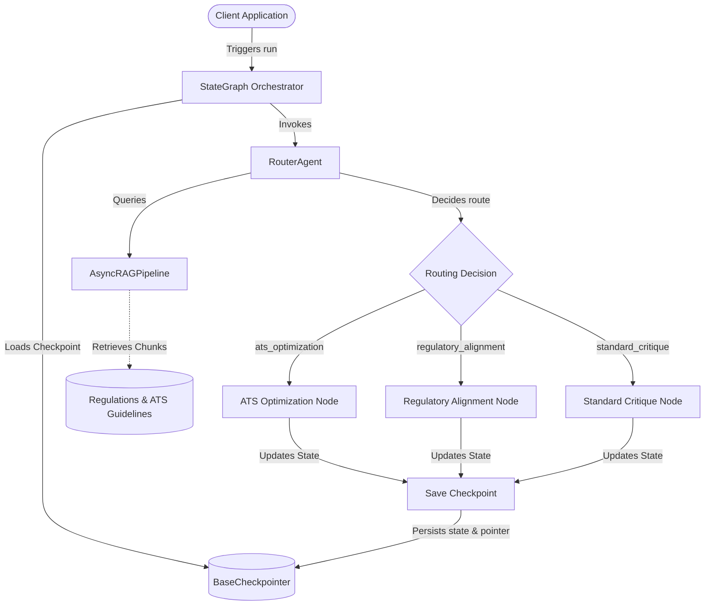

# resumesh-llm

<p align="center">
  
  
  
  
</p>

A professional-grade, lightweight, and production-ready Python library powering the intelligent LLM features of the **ResuMesh** CV and portfolio builder. Architected strictly on **SOLID** and **Domain-Driven Design (DDD)** principles, it provides robust, schema-validated, and provider-agnostic abstractions to analyze repositories, optimize resume metrics, and build active career journals.

---

## 🌟 Key Capabilities

*   **Advanced Agentic Workflows & Checkpointing**: Introduces a graph-based state machine (`StateGraph`) orchestration layer supporting deterministic critique-and-refine loops. Comes with memory/disk state checkpointing (`MemoryCheckpointer` / `FileCheckpointer`) to resume workflows seamlessly.
*   **Asynchronous RAG & Routing**: Provides an asynchronous keyword RAG retriever (`AsyncRAGPipeline`) and a dynamic routing agent (`RouterAgent`) to match resumes against ATS and compliance guidelines on the fly.
*   **Resilient API Clients & Strict Validation**: Automatic exponential backoff retries with randomized jitter, integrated with strict Pydantic V2 validation (`OutputParser`) to recover from rate limits and malformed LLM outputs.
*   **Standardized Schema Output**: Supports exporting optimized data mapping directly to the industry-standard, open-source **JSON Resume Schema**.
*   **Pluggable Provider Registry**: Built-in support for OpenAI, Groq, Ollama, Mock, and a dynamic registration pattern allowing developers to register and run custom LLM clients.

---

## 🛠️ Architecture Overview

Designed to prevent circular imports and keep dependencies clean, the library is partitioned into distinct subdomains using the **Facade Pattern** to export clean entry points:

```text
resumesh-llm/
├── src/
│   └── resumesh_llm/
│       ├── __init__.py         # Global Facade exports
│       ├── core/               # Base abstractions & engines
│       │   ├── exceptions.py   # Normalized package errors
│       │   ├── factory.py      # Dynamic LLMClientFactory & Provider Registry
│       │   ├── graph.py        # StateGraph & state checkpointing
│       │   ├── agent.py        # Critique-and-refine BulletRefinementAgent
│       │   ├── prompt_loader.py# Render template loader
│       │   ├── json_resume.py  # Standard JSON Resume Pydantic models
│       │   ├── rag.py          # Asynchronous RAG document retriever
│       │   ├── router.py       # Asynchronous LLM-backed Router Agent
│       │   ├── models/         # Single-responsibility data schemas
│       │   │   ├── generation_usage.py
│       │   │   ├── llm_request.py
│       │   │   └── llm_response.py
│       │   └── clients/        # Resilient LLM provider adapters & parsers
│       │       ├── base.py     # Abstract base LLMClient (with batch gather)
│       │       ├── retry.py    # Exponential backoff decorator
│       │       ├── parser.py   # Strict schema JSON output parser
│       │       ├── mock.py     # Offline development adapter
│       │       ├── openai.py
│       │       ├── groq.py
│       │       └── ollama.py
│       ├── github/             # GitHub analysis domain
│       │   ├── models.py       # Pydantic commit models (Strict)
│       │   └── summarizer.py   # Repository summaries and journal bullets
│       └── rxresume/           # Resume optimization domain
│           ├── models.py       # Pydantic response models (Strict)
│           ├── utils.py        # Resume formatting utilities
│           └── optimizer.py    # Bullet metrics & ATS alignment matcher
```

### Agentic Workflow & Checkpoint Pipeline



---

## 🚀 Frictionless 3-Step Quickstart

You can go from installation to optimizing your first resume bullet point in under 60 seconds:

### Step 1: Install the Library
```bash
pip install -e .
```

### Step 2: Set your API Key (Optional)
```bash
export OPENAI_API_KEY="your-api-key-here"
```

### Step 3: Run the Optimizer Snippet
```python
import asyncio
from resumesh_llm import LLMClientFactory, CVOptimizer

async def main():
    # 1. Instantiate the client (uses MockClient offline by default)
    client = LLMClientFactory.get_client(provider="mock")

    # 2. Initialize the optimizer
    optimizer = CVOptimizer(client=client)

    # 3. Optimize a resume bullet point using Google's XYZ formula
    result = await optimizer.optimize_bullet_point(
        raw_bullet="I worked on fixing bugs and writing tests",
        context="Backend Developer"
    )

    print(f"Original: {result.original}")
    print(f"Optimized: {result.optimized}")

async def run_alignment():
    # 4. Perform dynamic gap analysis comparing structured CV data to job description
    from resumesh_llm import JSONResume, JSONResumeBasics
    cv = JSONResume(basics=JSONResumeBasics(name="Developer", label="React Developer"))
    align_result = await optimizer.analyze_alignment(cv, "React Developer position")
    print(f"Alignment Score: {align_result.match_score}")

async def run_batch():
    # 5. Execute multiple requests concurrently
    from resumesh_llm import LLMRequest
    responses = await client.generate_batch([
        LLMRequest(prompt="Optimized bullet 1"),
        LLMRequest(prompt="Optimized bullet 2")
    ])
    print(f"Concurrent response counts: {len(responses)}")

asyncio.run(main())
```

---

## 🔌 Supported Providers & Settings

| Provider | Factory ID | Default Model | Authentication Key | Extra Parameters |
| :--- | :--- | :--- | :--- | :--- |
| **OpenAI** | `"openai"` | `gpt-4o` | `api_key` | `base_url` (optional) |
| **Groq** | `"groq"` | `llama-3.3-70b-versatile` | `api_key` | - |
| **Ollama** | `"ollama"` | `ollama` | - | `base_url` (default: `http://localhost:11434`) |
| **Mock** | `"mock"` | `mock-model` | - | `mock_response` (optional string) |

---

## 📚 Real-World Usage Patterns

We maintain a suite of ready-to-run scripts in the [examples/](file:///Users/atacan/ata-codes/resumesh-llm/examples) folder to help you integrate features:

1.  **[Basic Generation](file:///Users/atacan/ata-codes/resumesh-llm/examples/01_basic_generation.py)**: Querying general chat completions.
2.  **[Google XYZ Optimizer](file:///Users/atacan/ata-codes/resumesh-llm/examples/02_optimize_bullet.py)**: Enhancing experience bullet points with metrics.
3.  **[GitHub Ingestion](file:///Users/atacan/ata-codes/resumesh-llm/examples/03_github_journal.py)**: Extracting commit messages to build Career Journal logs.
4.  **[Self-Reflecting Agent](file:///Users/atacan/ata-codes/resumesh-llm/examples/04_agent_refinement.py)**: Graph-orchestrated critique loop targeting job descriptions.
5.  **[Standard JSON Resume](file:///Users/atacan/ata-codes/resumesh-llm/examples/05_json_resume.py)**: Validating and exporting data schemas.
6.  **[Dynamic Gap Analysis](file:///Users/atacan/ata-codes/resumesh-llm/examples/06_dynamic_gap_analysis.py)**: Performing gamified alignment analysis against target job description.
7.  **[Advanced RAG & Checkpointing](file:///Users/atacan/ata-codes/resumesh-llm/examples/07_advanced_rag_checkpointing.py)**: Demonstrating registry extension, checkpoint state saving, async RAG ingestion, and routing.

---

## 🧪 Testing & Linting

### Unit Testing
Run the complete, mock-supported test suite:
```bash
PYTHONPATH=src pytest
```

### Pre-Commit Hooks
Run formatting and styling verification hooks:
```bash
pre-commit run --all-files
```

---

## 📦 Releases & Versioning
Releases are automated via Google's **release-please** based on Conventional Commits. Use the following headers:
- `feat!:` / `fix!:` for breaking changes (bumps **Major** version).
- `feat:` for new library capabilities (bumps **Minor** version).
- `fix:` / `docs:` / `style:` for patches and maintenance (bumps **Patch** version).
