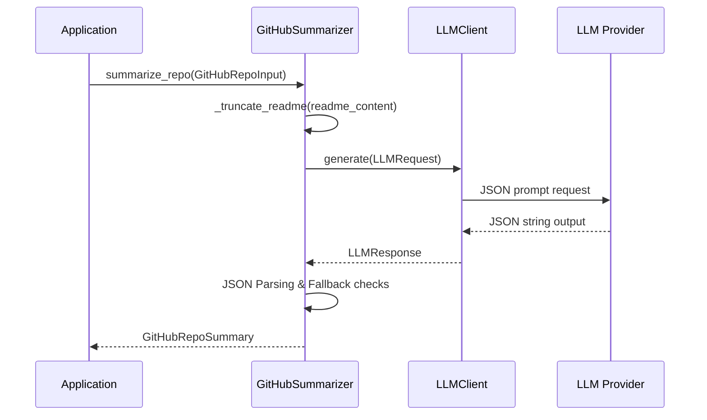

# GitHub Summarization Guide

The `GitHubSummarizer` converts raw repository data into professional developer highlights and descriptions suitable for a developer resume or portfolio website.

## How it Works

The service uses a prompt template that requests a structured JSON response back from the LLM, containing summary paragraphs, languages list, and technical resume highlights.



---

## API Reference

### Input Schema (`GitHubRepoInput`)

| Field | Type | Required | Description |
| --- | --- | --- | --- |
| `repo_name` | `str` | :white_check_mark: | Name of the repository. |
| `description` | `str` | :x: | Original description from GitHub. |
| `readme_content` | `str` | :x: | Readme markdown text. |
| `languages` | `List[str]` | :white_check_mark: | List of programming languages. |
| `stars` | `int` | :x: | Count of stars. |
| `forks` | `int` | :x: | Count of forks. |

### Output Schema (`GitHubRepoSummary`)

- `summary` (`str`): A concise description of the project (2-3 sentences), focusing on value and framework configurations.
- `tags` (`List[str]`): Professional topics (e.g. `OAuth2`, `Websockets`, `CI/CD`).
- `languages` (`List[str]`): Refined framework/language list (e.g. `FastAPI`, `React`, `TypeScript`).
- `highlights` (`List[str]`): Bullet points representing developer impact.

---

## Usage Example

```python
import asyncio
from resumesh_llm import LLMClientFactory, GitHubSummarizer, GitHubRepoInput

async def main():
    # Setup client
    client = LLMClientFactory.get_client(provider="mock")
    summarizer = GitHubSummarizer(client=client)

    # Prepare repository details
    repo = GitHubRepoInput(
        repo_name="ResuMesh-Backend",
        description="FastAPI service for cv building",
        readme_content="# ResuMesh Backend\nIntegrated with supabase storage and sentry tracking.",
        languages=["Python", "Dockerfile"],
        stars=150
    )

    # Process details
    result = await summarizer.summarize_repo(repo)
    print("CV Summary:", result.summary)
    print("Highlights:")
    for bullet in result.highlights:
        print(f" - {bullet}")

asyncio.run(main())
```
